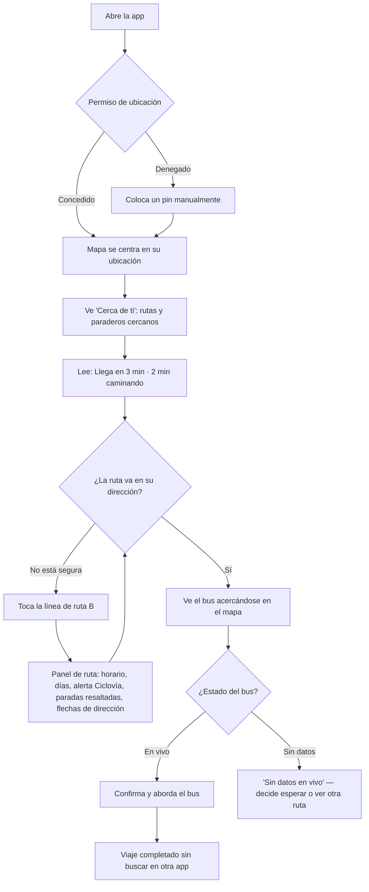

# UX Design Specification public_transport

**Author:** Vera
**Date:** 2026-08-17

---

<!-- UX design content will be appended sequentially through collaborative workflow steps -->

## Executive Summary

### Project Vision

A mobile-first web app that helps Bogotá TransMilenio/SITP riders — especially those facing an unfamiliar route — see every relevant bus route and stop near them at once, compare live options themselves, and decide where to walk, instead of the single-route lookup every existing tool forces. Built on official GTFS data with live BRT position layered on top, presented in plain Spanish "like a knowledgeable local friend," with the quieter long-term goal of teaching riders their own neighborhood well enough that they eventually need the app less, not more.

### Target Users

Primary: everyday Bogotá TransMilenio/SITP riders navigating an unfamiliar route — visitors, new residents, or regulars whose route was just restructured. Represented by two core journeys: Camila (already standing at an unfamiliar stop) and Andrés (deciding which of several nearby stops to walk to before leaving home). Real-world context: mid-range Android devices, sometimes weak signal inside enclosed BRT stations, often one-handed/standing use. Not assumed to be especially tech-savvy — plain language over operator jargon is a deliberate design principle, not an afterthought.

### Key Design Challenges

- Designing a scannable multi-route, multi-stop comparison view with no direct existing pattern to copy wholesale (closest loose precedents: Citymapper "Nearby," 9292 stops-nearby planner).
- Making the live vs. "position unavailable" state instantly, unambiguously distinguishable at a glance — never reading as stale-but-plausible data.
- Supporting low-data, weak-signal, one-handed use, including a coherent pre-JS/pre-map-load state (progressive enhancement).
- Keeping mandatory trust UI (non-affiliation, attribution, location-use disclosure) always visible without tipping into legal-notice clutter.

### Design Opportunities

- Treat the nearby-comparison view as the product's signature interaction, not "a map with pins" — this is where UX craft has the most leverage.
- Explore a subtle "familiarity" visual cue for routes a rider has seen before, reinforcing the teach-don't-trap goal (exploratory, not a committed requirement).
- Design shared route/stop links as strong standalone landing pages, since sharing is the primary growth path, not just in-app navigation.

## Core User Experience

### Defining Experience

The core loop is landing directly on the nearby-routes/stops comparison map — no search, no login — and being able to (1) see every route passing nearby and every nearby bus station at a glance, (2) drill into a specific route or stop for full detail, and (3) move the center point (not just live GPS) to explore a different location entirely. All three are treated as equally critical, not a primary flow plus edge cases.

**Scope note (2026-08-17):** "no search" describes the *landing experience* specifically — the homepage never asks a rider to search before showing them something useful. It does not mean the app has no search anywhere. See Component Strategy's Route Directory (added 2026-08-17) for how PRD FR5/FR6 (browse the full route list, search by name/number) are satisfied without compromising this landing principle.

### Platform Strategy

Web only, touch-primary and mobile-first as the primary target, but desktop is a real secondary target (e.g., planning a trip from a laptop before heading out) rather than a "just don't break it" afterthought. Offline/poor-connectivity resilience beyond the existing live-position graceful degradation is explicitly deferred to post-MVP. Device orientation/compass is skipped for v1 — not worth the complexity yet.

### Effortless Interactions

- No login required for any core action, including v1.
- Map auto-centers on the user's location on load when geolocation is granted; the last-viewed center point is remembered in the browser (no account) for return visits.
- When geolocation is denied, manually placing a pin is a first-class, fully-supported interaction — not a degraded fallback — respecting that some riders will decline location sharing by design choice, consistent with the project's no-data-harvesting stance.
- The app always shows the full set of nearby options rather than a single "recommended" route, so a rider who finds one route doesn't work for them isn't left stuck — they can see and evaluate alternatives themselves.

### Critical Success Moments

- The moment a rider can instantly tell which direction a bus is physically approaching from, and which directional variant of a route they're looking at (e.g., north-south vs. south-north) — ambiguity here breaks the core value proposition, since a rider could otherwise board going the wrong way.
- Seeing a live bus actually approaching their stop without having looked anything up beyond "what's near me" (Camila's journey).
- Comparing multiple nearby stops and self-deciding which to walk to, rather than trusting a single algorithmic answer (Andrés's journey).

### Experience Principles

- Land on the comparison, not a search box — the nearby-routes/stops view is the homepage.
- Exploration over prescription — always show the full nearby picture so riders can self-navigate to alternatives instead of hitting a dead end.
- Location is a choice, not a fallback — manual pin placement is first-class, not a degraded state for declined geolocation.
- Directionality must be unambiguous — both bus travel direction and route directional variant need distinct, glanceable visual treatment.

## Desired Emotional Response

### Primary Emotional Goals

Confident and empowered — the app should feel like a tool that teaches riders how Bogotá's transit system actually works, not a black box that hands them an answer. Success is measured by riders *learning* their routes, not by maximizing time spent in the app.

### Emotional Journey Mapping

- **Discovery:** relief and reassurance — "this actually understands Bogotá transit," in contrast to weak real-time coverage from Google Maps or uneven Moovit data.
- **Core action:** confidence and control while comparing nearby routes/stops themselves, not anxiety about whether they're reading it right.
- **Completion:** accomplishment — "I figured this out myself," reinforcing self-sufficiency over app-dependency.
- **Failure states:** informed, not alarmed — transparent about *whose* problem it is (see Design Implications) and reassured the maintainer already knows.
- **Return visits:** familiarity and trust, not a cold restart each time.

### Micro-Emotions

- **Confidence over confusion** — the load-bearing pair for the core comparison view.
- **Trust over skepticism** — critical given the "independent, non-affiliated, no black box" positioning; every failure state is an opportunity to reinforce or break this.
- **Accomplishment over frustration** — tied to the self-directed comparison, not a single algorithmic verdict.
- **Belonging over isolation** — a deliberate addition beyond the standard set: the product should feel like a community/collective effort ("built by and for riders"), not a commercial or bureaucratic product that happens to fail.

### Design Implications

- **Confidence/empowerment → explain, don't just answer.** UI copy and layout should make clear *why* a route/stop is shown (e.g., "these routes pass this stop, heading this direction") rather than presenting results as an opaque output.
- **Trust → honest, source-attributed error states.** Failures are split into two distinct, plainly-worded messages: (1) *our side* — acknowledged, actively being worked on, captured by Sentry, no blame-shifting; (2) *external/upstream* — explicitly named as a TransMilenio/SITP data or API issue outside this project's control, reinforcing the "we are an independent project, not the government" framing rather than eroding trust in the app itself.
- **Accomplishment → self-directed comparison, not a single verdict.** Reinforces the Core Experience principle of always showing the full nearby picture rather than one recommended route.
- **Belonging/community → tone and framing throughout,** not just a one-time disclaimer. The non-affiliation statement, attribution, and any error messaging should read as "an independent, community effort," not corporate boilerplate.

### Emotional Design Principles

- Teach, don't just answer — every core interaction should leave the rider understanding *why*, not just *what*.
- Be transparent about failure ownership — always distinguish "our bug" from "their API is down," and never hide behind a generic error.
- Design for self-sufficiency, not stickiness — success is a rider who needs the app less over time, not one who opens it more.
- Frame the project as a community effort, not a product — tone, copy, and trust UI should consistently read as independent and rider-built.

## UX Pattern Analysis & Inspiration

### Inspiring Products Analysis

- **MiniMetro** — abstracted, schematic route diagrams where color is reserved almost entirely for route identity; soft curves rather than sharp geometric lines even under high information density; reads as calm despite showing a lot at once.
- **Yandex Maps** — mostly soft/muted cartography with one confident, sparing accent color for what matters most; contrast is deliberate, not everywhere.
- **9292 (stops-nearby planner)** — minimal chrome, clear information hierarchy, function over decoration; closest existing product to this project's own restraint principle.
- **Regional Spanish-language references worth validating further:** RED Movilidad (Santiago, Chile — closest real-world analog as a BRT-style trunk system with well-regarded live-tracking UX), TMB App (Barcelona), EMT Madrid, and a second look at Moovit's LatAm UI patterns specifically (independent of its data-quality gaps).

### Transferable UX Patterns

**Navigation Patterns:**
- Minimal-chrome, map-first layout (9292, Yandex) — supports "land on the comparison, not a search box."

**Interaction Patterns:**
- Route color as the primary information-carrying visual layer (MiniMetro) — directly supports the directionality-clarity and multi-route-comparison requirements.

**Visual Patterns:**
- Black-and-white/neutral base with color spent only on meaning — route identity, live-vs-unavailable state — not decoration (MiniMetro, Yandex). Soft, rounded shapes over sharp geometric ones, supporting the "calm and confident," not "urgent and cluttered," emotional goal.

### Anti-Patterns to Avoid

- TransMiApp's dense, bureaucratic/jargon-heavy UI, where everything looks equally important and nothing is prioritized — conflicts with the "teach, don't overwhelm" goal.
- Moovit's ad-supported clutter and icon-soup density — conflicts with the calm/confident emotional target.
- Google Maps' generic, one-size-fits-all treatment that reflects nothing specific about how Bogotá's system actually works — conflicts with the "knowledgeable local friend" positioning.

### Design Inspiration Strategy

**What to Adopt:**
- Minimal-chrome, map-first navigation (9292, Yandex) — because it supports landing directly on the core comparison experience.
- Color reserved for meaning only — route identity and live/unavailable state — never decorative (MiniMetro, Yandex).

**What to Adapt:**
- MiniMetro's schematic abstraction — adapt (not adopt wholesale) for route-line rendering on a real geographic map rather than a fully abstracted diagram, since riders need actual geography, not just topology.

**What to Avoid:**
- Bureaucratic density (TransMiApp) and ad-driven visual clutter (Moovit) — both conflict with the confident/calm/trustworthy emotional goals already established.

This strategy will guide our design decisions while keeping public_transport unique.

## Design System Foundation

### 1.1 Design System Choice

Lightweight Custom Design System — hand-rolled CSS (no framework), built on a small set of design tokens (color, spacing, radius, type scale), loaded as a plain stylesheet through Django's static files app. No component library, no CSS framework dependency.

### Rationale for Selection

- **Technical fit:** the architecture's no-build, CDN-script-tag-only frontend (MapLibre GL JS via `<script>`, plain ES modules, no npm/bundler, no SPA framework) rules out nearly all modern established/themeable systems, which assume a JS build pipeline.
- **Visual fit:** the target aesthetic (MiniMetro/Yandex/9292-inspired — soft curves, black-and-white base, color reserved for meaning) is specific enough that an established system (Bootstrap, Material) would require heavy overriding rather than saving effort.
- **Scope fit:** small MPA surface area — nearby/comparison view, route detail, stop detail, a handful of shared components (map widget, trust footer) — doesn't justify a large component library's overhead.
- **Maintainer fit:** a solo, nights-and-weekends maintainer can reason about and evolve a small custom system faster than theming a large one.

### Implementation Approach

- A single base stylesheet (e.g., `static/ink?:inl/base.css`) defines design tokens as CSS custom properties: color palette (neutral B&W scale + route/status accent colors), spacing scale, border-radius scale (soft curves), type scale.
- Per-app stylesheets (`static/routes/`, `static/transmiapp/`) build on the shared tokens for page-specific styling, consistent with the existing per-app static asset structure from the architecture doc.
- No CSS reset framework dependency — a minimal custom reset (a handful of rules) ships alongside the tokens, kept small and understood in full rather than importing an external reset library.

### Customization Strategy

- Design tokens are the single source of truth for the soft-curves/B&W-plus-meaningful-color visual language — new components pull from tokens rather than hardcoding values.
- Route color and live/unavailable status color are the only two places saturated color is used by default; everything else stays neutral (per the Inspiration Analysis's "color spent only on meaning" principle).
- Component patterns (e.g., a stop card, a route-line legend entry) are documented informally in this system as they're built, rather than pre-specified in full before any UI exists — appropriate given the small, solo-maintained scope.

## 2. Core User Experience

### 2.1 Defining Experience

Land somewhere — via geolocation or a manually placed pin — and instantly see every route and stop within a fixed walkable radius, compared side by side, with live bus proximity where available. The pitch a rider might give a friend: "it shows me every bus near me at once, not just one route like the other apps."

### 2.2 User Mental Model

Riders today mentally cross-reference multiple apps or ask locals, with no single tool built around "compare what's near me." The base interaction — a map with nearby markers — is already familiar from any map app, so no new mental model is needed there. What's genuinely new is treating multi-route, multi-stop comparison as the primary view rather than a side effect of tapping pins one at a time.

### 2.3 Success Criteria

- Feels instant, backed by the <1s nearby-query performance target already set in the PRD.
- The soonest/closest live bus is scannable without an extra tap.
- Live vs. unavailable is unmistakable at a glance across every route shown, not just a single selected one.
- The map auto-centers on load when geolocation is permitted, with no "locate me" hunting required.

### 2.4 Novel UX Patterns

Combines an established pattern (map + nearby markers) with a novel layer (multi-route/multi-stop comparison as the primary view, not a secondary drill-down). Familiar base, novel twist — doesn't require teaching an entirely new interaction model.

### 2.5 Experience Mechanics

**1. Initiation:**
- On load, the browser requests geolocation (or uses an existing permission); if granted, the map auto-centers on the rider's location and immediately renders all routes/stops within a fixed default radius — a typical walkable distance (15–20 minutes on foot).
- If geolocation is denied or unavailable, the map falls back to the last remembered center (stored in the browser, no account) or a citywide default view, with manual pin placement offered as an equally first-class way to set "where."
- No search box, no "start" action required — the comparison view is what the rider sees immediately.

**2. Interaction:**
- Tapping or dragging on the map moves the center pin manually; the nearby query re-runs against the new center at the same fixed default radius.
- Tapping a **route line** opens a route detail panel: name/code, operating hours and days, a note if it's a Ciclovía-alternate routing, all stops on that route highlighted, and directional indicators (e.g., arrows, distinct per-direction styling) rendered along the line.
- Tapping a **stop marker** opens a stop detail panel: which routes serve that stop, with live bus proximity for each shown in the same comparison format as the main view.

**3. Feedback:**
- Live bus icons reflect current proximity in real time (within the live-tracking proxy's cache TTL); buses in an "unavailable" state render in a clearly distinct, muted style rather than looking like a stale live position.
- Selecting a route or stop visually highlights it while other routes recede, so the current selection is unambiguous.
- If a manually placed pin lands somewhere with no nearby routes or stops, an explicit empty state explains this rather than showing a blank map.

**4. Completion:**
- There's no formal "done" state — success is the rider deciding which stop to walk to or which bus to board, informed by the comparison. Completion is behavioral (they leave the app and walk), not an app-internal checkout state.
- On return visits, the app re-anchors on the same remembered center, ready for the next comparison.

## Visual Design Foundation

### Color System

A four-tier system, each tier meaning exactly one thing:

1. **System identity** — TransMilenio (closed BRT system) renders in a red base, echoing the real fleet livery; SITP zonal (open system, shares regular streets) renders in a traditional zonal blue. This is the coarsest visual signal, distinguishing which of the two systems a route/bus belongs to.
2. **Corridor color** — TM trunk corridors (A–M) use their real, official per-corridor colors (sourced from TransMilenio's own route signage/guide), layered on top of the red system-identity base as an accent stripe. SITP zonal routes have no equivalent official per-route color chart, so they rely on their route code/chip rather than a corridor color.
3. **App accent (Páramo)** — a muted, deliberately desaturated moss-green, reserved strictly for app chrome: "you are here," selection state, UI controls. Kept muted specifically so it's never confused with a vivid, fully-saturated route color. Carries a quiet thematic echo of Bogotá's páramo highland ecosystem and altitude identity, arrived at independently of — and without borrowing any assets from — the official Manual de Marca Ciudad "Bogotá," which was reviewed and deliberately not adopted (its bold red/yellow/blue tourism-marketing palette conflicts with both the calm/muted direction and the app's non-affiliation stance).
4. **Semantic (live/unavailable)** — independent of all of the above; a live bus and an unavailable one are never distinguished by hue alone, always paired with a distinct shape/fill treatment (see Map Markers below).

Neutrals (paper, ink, line, muted) are shared across both light and dark themes, defined as CSS custom properties; dark mode shifts neutrals to a warm near-black rather than a flat inversion, and route/system colors stay fixed since they're an external real-world reference, not part of the app's own palette.

Full palette, corridor color chart, and interactive light/dark + accent-direction toggle documented in `docs/visual-foundation-reference.html`.

### Typography System

System font stack only (`system-ui, -apple-system, "Segoe UI", Roboto, sans-serif`) — no custom webfont load, matching the architecture's lean-payload requirement (NFR1) and the no-build frontend decision. Hierarchy is carried by weight, size, and spacing rather than face variety. A monospace stack (`ui-monospace, "SF Mono", "Cascadia Mono", "Roboto Mono", monospace`) is reserved for tabular data — live arrival times, distances, route codes — giving them a "departure board" feel and enabling `font-variant-numeric: tabular-nums` for column alignment.

### Spacing & Layout Foundation

An 8-scale spacing system (4px–48px) drives all layout gaps (flex/grid `gap`, not per-element margins). Border radii follow a small soft-curves scale (8px / 14px / 22px) sized to element scale, and route lines render at 2–3px stroke width — both directly implementing the Madrid Metro Map–inspired restraint from the Inspiration Analysis (thin lines, generous whitespace, soft over sharp).

### Accessibility Considerations

- WCAG AA contrast (4.5:1 minimum) applies across all tiers of the color system, including route corridor colors against their marker backgrounds.
- No state is ever color-only: live vs. unavailable buses differ in shape (filled vehicle body vs. dashed outline), not just color; route direction is shown via an arrow/heading plus a lightness variation, not hue alone — directly serving FR20/NFR11–13 and the colorblind-safe requirement raised during Core Experience design.
- Font sizes stay readable by default (system font stack, no custom face risking poor hinting at small sizes); keyboard navigation remains a first-class requirement carried from the PRD, unaffected by any visual-layer decision here.

## Design Direction Decision

### Design Directions Explored

Five structural directions for the nearby-comparison screen — the one screen carrying the most weight in the Core User Experience — all built on the Visual Design Foundation above:

1. **Bottom sheet** — full-bleed map, draggable sheet with the route list (Uber/Google Maps convention).
2. **Split stack** — map fixed to the top half, list filling the rest below, no overlap or drag gesture.
3. **List-first** — the list is primary; the map is an optional "Ver en mapa" enhancement per row.
4. **Map-dominant, minimal chrome** — map fills ~85% of the screen; routes reduce to a scrollable chip strip.
5. **Side-by-side** — map and list permanently side by side once there's desktop/tablet width to spare.

Full interactive comparison, including light/dark rendering, documented in `docs/design-direction-mockups.html`.

### Chosen Direction

**Direction 2 (Split Stack) for mobile, Direction 5 (Side-by-side) for desktop/tablet.** Direction 5 is not a competing choice — it's how Direction 2 naturally extends once there's width to spare, not a separate design language.

### Design Rationale

- The Core Experience principle established earlier treats seeing the map, seeing the full list, and moving the pin as **equally critical**, not a primary flow plus edge cases. Split Stack is the only direction that keeps map and list permanently, simultaneously visible without a gesture layer or a hidden-by-default state standing between the rider and either one.
- It's the cleanest fit for Progressive Enhancement (PRD Web App Requirements): map-block-then-list-block is a trivial server-rendered DOM order — if the map/JS layer is slow or fails, the list still renders in place.
- Direction 1 (bottom sheet) is the most polished-feeling but needs real gesture-handling JS, disproportionate complexity for a solo, no-build stack. Direction 3 undersells the map-first identity core to the brief. Direction 4 hides full route detail behind a chip carousel, in tension with "always show the full nearby picture, never a single answer."

### Implementation Approach

Three refinements surfaced during review and are folded into the chosen direction (all documented with visuals in `docs/design-direction-mockups.html`):

- **Time display, in plain language.** Not icon+number pairs but a sentence: *"Llega en X min · Y min caminando."* A comfortable margin needs nothing further; a tight one gets an honest, action-oriented close — *sal ya* (leave now) or *no alcanzas* (you won't make it) — still shown, never hidden. Both figures derive from the stop's already-known straight-line distance, not a new routing dependency. Routes without live tracking read *"Sin datos en vivo"* — a distinct case from the walk/wait timing question.
- **Overlapping/parallel routes bundle, not stack.** Where two or more routes share a physical corridor for a stretch (real for TM trunk lanes), each line offsets a few pixels perpendicular to the shared path so every corridor color stays visible as thin parallel strokes — the standard transit-cartography technique (Citymapper, official metro diagrams), not a novel invention.
- **Marker taxonomy — three distinct silhouettes, not just colors.** "Tu ubicación" (the rider's chosen center point, live GPS or manually placed) is a **teardrop pin**, anchored at its point — deliberately not a circle, so it can never be confused with a stop. TM stations use a **halo-ring** marker (a larger dot with a ring around it — the "interchange station" convention from real metro diagrams). SITP paraderos keep a **plain small dot**. Neither stop type defaults to a route's color since a stop can serve many routes at once — both stay neutral with a small route-count badge at rest, taking on a specific route's color only once that route is selected. The "Cerca de ti" heading (borrowed from Direction 3) is retained atop the list in both Direction 2 and 5 for clarity.

## User Journey Flows

### Journey 1: Camila — Already at a Stop



### Journey 2: Andrés — Leaving Home, Choosing a Stop

```mermaid
flowchart TD
    A[Abre la app antes de salir] --> B{Ubicación}
    B -->|GPS o último centro recordado| C["Ve 'Cerca de ti' desde su casa"]
    C --> D[Compara varias filas: Av. Boyacá, Av. Villas, Calle 127]
    D --> E{¿Alguna dice "sal ya" o "no alcanzas"?}
    E -->|Sí, H · Caracas Sur: sal ya| F[Nota que debe salir pronto para esa opción]
    E -->|No hay prisa| G[Compara tranquilamente las opciones]
    F --> H{¿Quiere revisar otra calle?}
    G --> H
    H -->|Sí| I[Mueve el pin manualmente a otra calle]
    I --> C
    H -->|No| J[Toca la ruta elegida para confirmar dirección]
    J --> K[Panel de ruta: confirma que la dirección lo acerca a su destino]
    K --> L[Sale y camina a la parada elegida]
    L --> M[Con el tiempo, deja de necesitar la app para esta ruta]
```

### Journey Patterns

**Navigation Patterns:**
- Land directly on the comparison — no search step in either journey, matching "land on the comparison, not a search box."
- Tap-to-detail is the single interaction pattern for going deeper on both a route and a stop; no separate navigation model for each.

**Decision Patterns:**
- Both journeys resolve through comparison, not a single recommendation — the app surfaces multiple options with honest, plain-language timing (including "sal ya"/"no alcanzas") and lets the rider decide, never auto-selecting a "best" choice.
- Manual pin placement is a first-class loop back into the same comparison view, not a separate flow — Journey 2 shows this directly (moving the pin to check another street).

**Feedback Patterns:**
- Live vs. "sin datos en vivo" is always surfaced explicitly at the point of decision, never silently defaulting to one or the other.
- Direction confirmation happens before boarding in both journeys — the route detail panel is where a rider double-checks they're reading the right direction, tying back to the "unmistakable directionality" success criterion.

### Flow Optimization Principles

- Zero-tap value: the nearby comparison is visible the instant the map loads — no journey requires a search or setup step before seeing something useful.
- No dead ends: declining geolocation loops into manual pin placement rather than blocking the journey.
- Edge cases are surfaced, not hidden: "sin datos en vivo," "sal ya," and "no alcanzas" all appear inline in the same flow, not as separate error states the rider has to recover from.
- The long-term payoff (Journey 1's "sin buscar en otra app," Journey 2's "deja de necesitar la app") is the natural endpoint of the flow, not a bolted-on message — it falls out of the comparison-first design itself.

## Component Strategy

### Design System Components

None — the chosen design system (Step 6) is a lightweight custom system with no component library. Every component below is built directly from the established design tokens (color, spacing, radius, type scale) rather than adapted from a pre-built set.

### Custom Components

#### Nearby Route Row

**Purpose:** The atomic unit of the core comparison view — lets a rider evaluate one route/stop option at a glance.
**Content:** Route chip (letter or alphanumeric code, system + corridor color), route/corridor name and destination, plain-language ETA line.
**Actions:** Tap anywhere on the row to open the route or stop detail panel.
**States:** Live (green-worded ETA), no live data ("Sin datos en vivo," muted), tight margin ("— sal ya," caution tone), unreachable ("— no alcanzas," muted/struck), default resting state (comfortable margin, no flag).
**Variants:** None structural — the row auto-widens its chip for longer alphanumeric codes (TM single-letter vs. SITP zonal codes like K309) rather than needing a separate layout.
**Accessibility:** Entire row is a single tap target (not just the chip); state words ("sal ya," "no alcanzas," "sin datos en vivo") are real text, not color-only, so they're screen-reader legible and meet the no-color-alone rule from Accessibility Considerations.
**Content Guidelines:** Always phrased as a sentence ("Llega en X min · Y min caminando"), never bare numbers — ties to the "explain, don't just answer" emotional design principle.

#### Map Marker Set

**Purpose:** Three structurally distinct marker types so the map stays legible at a glance while walking.
**Content/Anatomy:**
- **"Tu ubicación"** — teardrop pin, anchored at its point, app-accent color, never used for anything else.
- **SITP paradero** — plain small dot, neutral at rest, fills with a route's corridor color when that route is selected.
- **TM station** — halo-ring (larger dot + ring), same states as paradero, plus a route-count badge when serving multiple routes and none is selected.
- **Bus marker** — rounded capsule with a pale windshield band marking the front, rotates to heading; TM buses render red with a corridor-color stripe, SITP buses render blue with no stripe.
**States:** Live (filled, full color) vs. unavailable (dashed outline, same silhouette, muted color, no heading claimed) — applies to the bus marker only; stop markers don't have a live/unavailable state.
**Variants:** None beyond system (TM/SITP) and selection state — deliberately kept to a small, learnable set rather than one-off icons per situation.
**Accessibility:** Every state pair (live/unavailable, station/paradero, location/stop) differs in shape or fill pattern, not color alone, per the no-color-only rule.
**Content Guidelines:** N/A — purely visual components with no text content of their own (labels live in the associated row/panel, not on the marker).

#### Route Detail Panel

**Purpose:** Opened by tapping a route line or a route row; the point where a rider confirms direction and gets full route info before boarding.
**Content:** Route name/corridor, operating hours and days, a Ciclovía-alternate-routing tag when applicable, the full stop list for that route with per-stop ETA in the same plain-language format as the main list.
**Actions:** Tap a stop within the panel to see that stop's own detail; dismiss to return to the main comparison.
**States:** Same live/no-data/sal-ya/no-alcanzas states as the Nearby Route Row, applied per stop within the panel.
**Variants:** None — one panel layout serves both directions of a route (direction is shown via the marker/line treatment already defined, not a separate panel variant).
**Accessibility:** Panel is reachable and dismissible via keyboard; stop list within it follows the same tap-target and no-color-alone rules as the main list.
**Content Guidelines:** Hours/days and Ciclovía notes are plain Spanish, no operator jargon — same voice as the rest of the app.

#### Trust Footer

**Purpose:** Structurally guarantees FR14–FR16 (non-affiliation, attribution, location-use disclosure) are always visible rather than repeated ad hoc per page.
**Content:** Non-affiliation statement, GTFS data source attribution, short plain-language location-use disclosure.
**Actions:** None — informational only, no interactive elements required.
**States:** Single state, always rendered identically.
**Variants:** None — one footer, present on every page via the base template, per the architecture's `app/templates/layout/base.html` decision.
**Accessibility:** Plain text, standard contrast and font-size rules apply; no special ARIA needed since it's static content.
**Content Guidelines:** Short, honest, community-toned — reinforces the "independent effort, not corporate/government" emotional goal, not legal boilerplate.

#### Route Directory (added 2026-08-17)

**Purpose:** Satisfies FR5 (browse the full route list) and FR6 (search by name/number) — the one PRD requirement pair with no coverage anywhere else in this spec, surfaced by the 2026-08-17 implementation readiness assessment. **Decision:** keep FR5/FR6 in MVP scope (not deferred to Phase 2) and satisfy them with a small, secondary page — not by adding a search box to the homepage. The homepage's "land on the comparison, not a search box" principle (Core Experience) is about the *landing* experience specifically and stays exactly as designed; this component is deliberately never the first thing a rider sees. Reasoning for keeping rather than deferring: the underlying per-route detail page already exists and is shareable (FR17–18) — what's missing is purely *discovery* for a rider who knows a route code but isn't near a stop right now (e.g., checking a route from home, out of curiosity, or because a friend mentioned a code with no link). That's a real, if secondary, use case the nearby-first flows don't cover, and the fix is cheap enough (one more server-rendered list page, reusing existing components) that deferring it would be avoiding a small job, not respecting real scope pressure.
**Content:** A plain list of all active (`is_active=True`) routes, each row rendered with the *same* Nearby Route Row treatment (route chip, system + corridor color, name) minus the ETA/distance columns, which have no meaning without a location context. Grouped or filterable by `route_mode`/`service_tier` (TransMilenio trunk vs. TransMiZonal), not flattened into one undifferentiated list of ~550 rows.
**Actions:** A plain text filter input (server-rendered, `?q=` query param — matches an existing shareable-URL pattern already used elsewhere, not a new client-side search index) narrows the list by name or code on submit, not live as the rider types — consistent with the no-JS baseline stated under Accessibility below; each row taps through to that route's existing detail page/panel, reusing the Route Detail Panel component as-is.
**States:** No live/unavailable states here — this is static route metadata, not a live comparison; empty-filter state ("no routes match") uses the same honest-empty-state pattern already established for the nearby view.
**Variants:** None.
**Accessibility:** Real `<input>` and `<a>`/`<button>` elements, filter works without JS (server-rendered on submit) as a progressive-enhancement baseline, consistent with every other component in this spec.
**Content Guidelines:** Same plain-Spanish, no-jargon voice as the rest of the app; reached via a low-emphasis link (e.g., "Ver todas las rutas") from the Trust Footer or a similar always-present but non-competing location — never a prominent homepage element, so it doesn't dilute "land on the comparison."

### Component Implementation Strategy

- Every component pulls from the design tokens established in Visual Design Foundation (color tiers, spacing scale, radius scale) — no component hardcodes a one-off value.
- Components stay small and few by design: five custom components (four original plus the Route Directory added 2026-08-17 to close the FR5/FR6 gap) cover both critical journeys end to end plus full-catalog browse/search, consistent with the "solo, nights-and-weekends, MVP-sized" constraint that has shaped every prior decision — the Route Directory reuses the Nearby Route Row and Route Detail Panel rather than inventing new visual language, keeping the actual net-new surface small.
- Accessibility rules (no color-alone states, real tap targets, plain-language content) are enforced per-component here rather than left as a general aspiration.

### Implementation Roadmap

**Phase 1 — Core Components (blocks both journeys):**
- Nearby Route Row — the primary interaction surface for both Camila and Andrés.
- Map Marker Set — required the moment the map renders anything at all.

**Phase 2 — Supporting Components:**
- Route Detail Panel — needed for the "confirm direction before boarding" step in both journeys, but only reachable after Phase 1 exists.

**Phase 3 — Enhancement Components:**
- Trust Footer — structurally required by the PRD but not on the critical interaction path; can land alongside the base template work rather than blocking the comparison view.
- Route Directory — satisfies FR5/FR6 but blocks neither Camila's nor Andrés's journey; lowest priority of the five components, but still MVP (not Phase-2-deferred), since it's cheap and closes a named PRD requirement.

## UX Consistency Patterns

### Button Hierarchy

Minimal by design — there is no primary/secondary button system in the traditional sense, because the core interactions are direct manipulation (tap a row, tap a marker, drag the pin) rather than button-triggered actions. The one recurring control, "Ver en mapa" (Direction 3's per-row map toggle, not used in the chosen Direction 2/5), follows a single low-emphasis pill style — soft accent background, no bordered/filled hierarchy needed since there's nothing competing with it for attention.

### Feedback Patterns

The richest pattern category in this app, since almost every piece of live/derived data needs an honest state:

- **Live data:** plain text, live-colored word inline in the ETA sentence (e.g., "Llega en **3 min**").
- **No live data:** "Sin datos en vivo," muted color — a data-availability problem, distinct from timing.
- **Tight timing margin:** "— sal ya," caution color, action-oriented phrasing (Design Direction Decision).
- **Unreachable:** "— no alcanzas," muted/struck, still shown rather than hidden — never silently filtered out.
- **System-side errors** (our bug): acknowledged in-product, captured by Sentry, plain-language "estamos en eso" tone — no raw stack traces reach the rider (Desired Emotional Response, Design Implications).
- **Upstream errors** (TransMilenio/SITP API down): explicitly attributed to the external source, not phrased as the app's own failure — reinforces the independent-project trust stance.

All feedback is text-first; color reinforces but never carries the meaning alone, per Accessibility Considerations.

### Form Patterns

No login, no settings to submit, and the homepage itself has no search input (Core Experience: "land on the comparison, not a search box"). The one input-like interaction on the core flow, manually placing a location pin, is direct map manipulation, not a form field. **Updated 2026-08-17:** the Route Directory (Component Strategy) does introduce one real form field — a plain text filter, server-rendered on submit — but it lives on its own secondary page, not the homepage, so this doesn't change the core-flow statement above.

### Navigation Patterns

- **Tap-to-detail is the navigation model for the core comparison flow** — established in Core Experience and Component Strategy, used identically for routes and stops. The Route Directory (added 2026-08-17) adds one secondary entry point (filter-then-tap) for riders who already know what they're looking for; it still ends at the same tap-to-detail destination, so this isn't a second navigation model, just a second on-ramp to the same one.
- **Panel and page are the same content, two renderings.** Because per-route/per-stop links must be shareable and directly loadable (PRD FR17–18), each route/stop detail has its own real URL, server-rendered per the MPA architecture. On the nearby view, tapping opens that same content as an in-page panel (fast, no reload); a cold visit to the shared URL renders the identical content as a full page. This is a progressive-enhancement detail, not two different designs to maintain.
- **No back-button surprises:** opening a panel updates the URL (so sharing/refresh/back all resolve to the same state), consistent with "server-rendered, shareable... URLs" from the PRD's Web App Requirements.

### Additional Patterns

**Empty States:** If a manually placed pin or GPS location has no nearby routes/stops, an explicit message explains this plainly rather than showing a blank map (already established in Core Experience Feedback mechanics) — never a generic "no results."

**Loading States:** No global spinner or loading screen. Each map/list widget shows a small local text placeholder while its own data is in flight, consistent with the architecture's existing "no global loading state" decision (Implementation Patterns, Process Patterns) — this UX spec doesn't introduce a second loading paradigm, it just confirms the same one applies at the UI layer.

## Responsive Design & Accessibility

### Responsive Strategy

One fluid layout, not two designs. Direction 2 (Split Stack) and Direction 5 (Side-by-side) are the same two components — a map block and a list block — reflowed by a single CSS property change (`flex-direction: column` → `row`) at one breakpoint, not separate markup or a distinct "desktop experience." This satisfies the PRD's "single responsive layout... rather than separate experiences" requirement literally, not just in spirit.

- **Mobile (primary target):** Split Stack, full-width, touch-primary.
- **Desktop/tablet (real secondary target, not an afterthought):** Side-by-side once there's width to spare — map gets more horizontal room, list becomes a persistent side column instead of a scrolling block below.
- No distinct tablet-only treatment — tablets fall on whichever side of the single breakpoint their width lands on.

### Breakpoint Strategy

A single breakpoint at **768px**, switching the nearby-comparison layout from stacked to side-by-side. Deliberately one breakpoint, not three — matches the "no separate experiences" requirement and the broader lean-implementation stance already established (no-build frontend, solo maintainer). Route/stop detail panels and the trust footer don't need their own breakpoint logic; they inherit the same reflow.

### Accessibility Strategy

**Target: WCAG 2.1 Level AA** — not a legal requirement (no auth, no regulated domain per PRD Domain-Specific Requirements), but a genuine extension of the project's inclusivity stance, already the working target throughout Visual Design Foundation and Accessibility Considerations.

**Key requirements, already established and restated here as the compliance baseline:**
- 4.5:1 minimum contrast, including corridor colors against their marker backgrounds.
- No state conveyed by color alone (live/unavailable shape difference, direction arrow + tint, text-based feedback labels).
- Real tap targets on interactive rows (not just the visual chip), sized for touch.
- Keyboard-operable core navigation — route/stop selection and panel dismissal on the nearby view; the Route Directory's filter input and result links (added 2026-08-17) are standard keyboard-operable form/link elements, no special handling needed.
- Readable default font sizes, no reliance on pinch-zoom.

### Testing Strategy

Scoped to what a solo, nights-and-weekends maintainer can realistically sustain — not a QA-team-sized plan:

- **Manual device testing:** primary target is a real mid-range Android phone on Chrome (matches the brief's actual usage context) — this matters more than broad cross-browser coverage for a niche, regional app.
- **Keyboard-only pass:** a manual checklist item before each release (tab through nearby list, open/dismiss a route panel, no traps) — not automated infrastructure.
- **One screen-reader pass before launch:** Android TalkBack (matches the primary device), to catch anything the plain-language/no-color-alone rules missed — not an ongoing test suite.
- **Color-blindness sanity check:** spot-check the corridor color set and live/unavailable states with a simulator (e.g., browser dev tools' vision deficiency emulation) once, during the Visual Foundation build-out — not per-release.
- No dedicated automated accessibility CI step planned for v1 — the existing GitHub Actions CI (pytest + black + flake8, per architecture) stays focused on correctness; revisit only if manual passes keep surfacing regressions.

### Implementation Guidelines

- Relative units throughout (rem for type, the established spacing/radius token scale) — no fixed-pixel layout assumptions.
- Mobile-first CSS: base styles are the Split Stack layout; the single `min-width: 768px` media query flips to side-by-side, not the reverse.
- Interactive rows and markers use real semantic elements (`<button>`/`<a>`, not `<div onclick>`), so keyboard and screen-reader support come from the platform rather than being bolted on with ARIA.
- Map markers (SVG) carry accessible labels (route name, stop name, live/unavailable state) even though the map itself is a progressive enhancement — the underlying server-rendered list is the accessible source of truth, per the Progressive Enhancement principle already established.
- Focus states are visible by default (no `outline: none` without a real replacement), consistent with the "readable, operable" bar set in the PRD.
